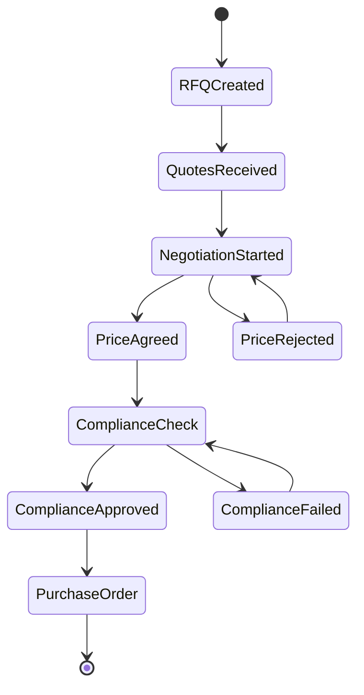
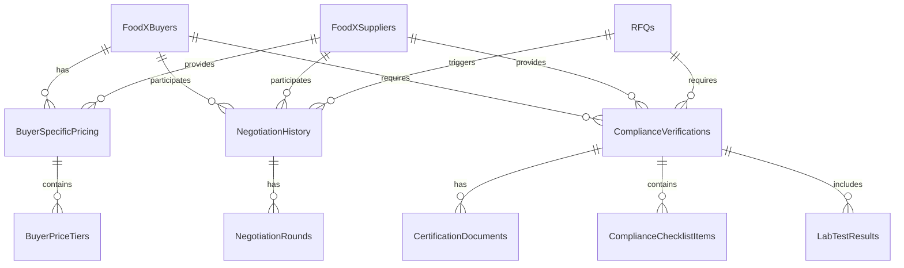

# FDX.Trading Buyer Journey and Pricing System Documentation

## Executive Summary

This document describes the complete buyer journey and pricing architecture for FDX.Trading, including the secure buyer-specific pricing system, multi-round negotiation workflow, and compliance verification process. The system ensures complete pricing confidentiality between buyers while enabling transparent negotiations and regulatory compliance.

---

## 1. Buyer Journey Overview

### 1.1 Complete Workflow Stages

```mermaid
graph LR
    A[Product Discovery] --> B[AI Product Definition]
    B --> C[RFQ Creation]
    C --> D[Supplier Matching]
    D --> E[Price Quotation]
    E --> F[Price Negotiation]
    F --> G[Price Agreement]
    G --> H[Compliance Verification]
    H --> I[Purchase Order]
    I --> J[Order Fulfillment]
```



### 1.2 Stage Details

#### Stage 1: Product Discovery
- Buyers search for products using AI-powered search
- Visual product identification through image upload
- Category browsing and filtering

#### Stage 2: AI Product Definition
- Azure Vision API analyzes product images
- Automatic extraction of product specifications
- Generation of standardized product descriptions

#### Stage 3: RFQ Creation
- Automated RFQ generation from AI analysis
- Manual refinement of requirements
- Attachment of specifications and documents

#### Stage 4: Supplier Matching
- Intelligent matching based on product categories
- Geographic proximity consideration
- Supplier capability assessment

#### Stage 5: Price Quotation
- Suppliers receive RFQ notifications
- Submission of detailed pricing including all costs
- Confidential buyer-specific pricing storage

#### Stage 6: Price Negotiation
- Multi-round negotiation tracking
- Email and phone communication logging
- Price movement history

#### Stage 7: Price Agreement
- Final price confirmation
- Terms and conditions agreement
- Price validity period setting

#### Stage 8: Compliance Verification
- Certificate validation (Kosher, Halal, Organic, etc.)
- Laboratory test results review
- Regulatory requirement checking

#### Stage 9: Purchase Order
- Automated PO generation
- Payment terms confirmation
- Delivery schedule setting

#### Stage 10: Order Fulfillment
- Shipment tracking
- Quality inspection
- Invoice generation

---

## 2. Database Schema and Tables

### 2.1 Core Pricing Tables

#### **BuyerSpecificPricing**
**Purpose:** Stores confidential pricing information visible only to specific buyers

| Column | Type | Description |
|--------|------|-------------|
| Id | INT | Primary key |
| BuyerId | INT | Foreign key to FoodXBuyers |
| SupplierId | INT | Foreign key to FoodXSuppliers |
| ProductCode | NVARCHAR(100) | Product identifier |
| ProductName | NVARCHAR(200) | Product description |
| NegotiatedUnitPrice | DECIMAL(18,4) | Agreed unit price |
| Currency | NVARCHAR(3) | Currency code (EUR, USD, etc.) |
| MinimumOrderQuantity | DECIMAL(18,2) | MOQ requirement |
| Unit | NVARCHAR(50) | Unit of measurement |
| FreightCostPerUnit | DECIMAL(18,4) | Shipping cost per unit |
| CustomsDutyRate | DECIMAL(5,2) | Import duty percentage |
| InsuranceRate | DECIMAL(5,2) | Insurance percentage |
| Incoterms | NVARCHAR(10) | Delivery terms (FOB, CIF, etc.) |
| PaymentTerms | NVARCHAR(200) | Payment conditions |
| LeadTimeDays | INT | Delivery lead time |
| ValidFrom | DATETIME | Price validity start |
| ValidUntil | DATETIME | Price validity end |
| ConfidentialityLevel | NVARCHAR(50) | Security level (Strict/Normal) |
| IsConfidential | BIT | Confidentiality flag |

**Key Features:**
- Row-level security ensures prices are never visible to other buyers
- Includes all cost components for total landed cost calculation
- Tracks price validity periods
- Supports multiple currencies and Incoterms

#### **BuyerPriceTiers**
**Purpose:** Volume-based pricing tiers for quantity discounts

| Column | Type | Description |
|--------|------|-------------|
| Id | INT | Primary key |
| BuyerSpecificPricingId | INT | Foreign key to BuyerSpecificPricing |
| MinQuantity | DECIMAL(18,2) | Minimum quantity for tier |
| MaxQuantity | DECIMAL(18,2) | Maximum quantity for tier |
| TierPrice | DECIMAL(18,4) | Price for this tier |
| DiscountPercentage | DECIMAL(5,2) | Discount percentage |

**Key Features:**
- Enables volume-based pricing strategies
- Automatic price calculation based on order quantity
- Supports unlimited pricing tiers

### 2.2 Negotiation Tracking Tables

#### **NegotiationHistory**
**Purpose:** Tracks complete negotiation lifecycle between buyers and suppliers

| Column | Type | Description |
|--------|------|-------------|
| Id | INT | Primary key |
| NegotiationNumber | NVARCHAR(50) | Unique negotiation identifier |
| BuyerId | INT | Foreign key to FoodXBuyers |
| SupplierId | INT | Foreign key to FoodXSuppliers |
| RFQId | INT | Foreign key to RFQs |
| ProductName | NVARCHAR(200) | Product being negotiated |
| Quantity | DECIMAL(18,2) | Quantity requested |
| StartedAt | DATETIME | Negotiation start date |
| CompletedAt | DATETIME | Negotiation end date |
| Status | NVARCHAR(50) | Current status |
| InitialPrice | DECIMAL(18,4) | Starting price |
| FinalAgreedPrice | DECIMAL(18,4) | Final agreed price |
| TotalRounds | INT | Number of negotiation rounds |
| EmailCount | INT | Number of emails exchanged |
| PhoneCallCount | INT | Number of phone calls |

**Key Features:**
- Complete audit trail of negotiations
- Tracks communication frequency
- Calculates price reduction percentage
- Links to RFQ and quotes

#### **NegotiationRounds**
**Purpose:** Individual negotiation interactions and price movements

| Column | Type | Description |
|--------|------|-------------|
| Id | INT | Primary key |
| NegotiationHistoryId | INT | Foreign key to NegotiationHistory |
| RoundNumber | INT | Sequential round number |
| OccurredAt | DATETIME | Round timestamp |
| CommunicationMethod | NVARCHAR(50) | Email/Phone/Meeting |
| ProposedPriceBuyer | DECIMAL(18,4) | Buyer's offer |
| ProposedPriceSupplier | DECIMAL(18,4) | Supplier's counter |
| AgreedPrice | DECIMAL(18,4) | Agreed price if any |
| DiscussionSummary | NVARCHAR(2000) | Round summary |
| Outcome | NVARCHAR(50) | Round result |

**Key Features:**
- Detailed tracking of each negotiation step
- Price movement history
- Communication method logging
- Discussion documentation

#### **NegotiationEmailTemplates**
**Purpose:** Pre-configured templates for negotiation communications

| Column | Type | Description |
|--------|------|-------------|
| Id | INT | Primary key |
| TemplateName | NVARCHAR(100) | Template identifier |
| TemplateType | NVARCHAR(50) | Template category |
| Subject | NVARCHAR(200) | Email subject |
| Body | NVARCHAR(MAX) | Email content |
| Variables | NVARCHAR(500) | Dynamic variables |

**Default Templates:**
- Initial Price Request
- Counter Offer
- Price Acceptance
- Price Rejection

### 2.3 Compliance and Certification Tables

#### **ComplianceVerifications**
**Purpose:** Manages product compliance and certification requirements

| Column | Type | Description |
|--------|------|-------------|
| Id | INT | Primary key |
| VerificationNumber | NVARCHAR(50) | Unique verification ID |
| BuyerId | INT | Foreign key to FoodXBuyers |
| SupplierId | INT | Foreign key to FoodXSuppliers |
| RFQId | INT | Foreign key to RFQs |
| ProductName | NVARCHAR(200) | Product name |
| BuyerCountry | NVARCHAR(100) | Destination country |
| RegulatoryAuthority | NVARCHAR(500) | FDA/EFSA/FSA etc. |
| Status | NVARCHAR(50) | Verification status |
| RequiresKosher | BIT | Kosher requirement |
| RequiresHalal | BIT | Halal requirement |
| RequiresOrganic | BIT | Organic requirement |
| RequiresGlutenFree | BIT | Gluten-free requirement |
| RequiresNonGMO | BIT | Non-GMO requirement |
| RequiresFDA | BIT | FDA approval requirement |
| ValidFrom | DATETIME | Compliance validity start |
| ValidUntil | DATETIME | Compliance validity end |

**Key Features:**
- Country-specific regulatory tracking
- Multiple certification requirements
- Validity period management
- Conditional approval support

#### **CertificationDocuments**
**Purpose:** Stores certification documents and validity

| Column | Type | Description |
|--------|------|-------------|
| Id | INT | Primary key |
| ComplianceVerificationId | INT | Foreign key |
| CertificationType | NVARCHAR(100) | Certificate type |
| CertificateName | NVARCHAR(200) | Certificate name |
| CertificateNumber | NVARCHAR(100) | Certificate ID |
| IssuingAuthority | NVARCHAR(200) | Issuing body |
| IssueDate | DATETIME | Issue date |
| ExpiryDate | DATETIME | Expiry date |
| DocumentUrl | NVARCHAR(500) | Document location |
| VerificationStatus | NVARCHAR(50) | Verification status |

**Key Features:**
- Document integrity verification
- Expiry tracking and alerts
- Multiple certificate types
- Verification workflow

#### **ComplianceChecklistItems**
**Purpose:** Compliance requirement checklist

| Column | Type | Description |
|--------|------|-------------|
| Id | INT | Primary key |
| ComplianceVerificationId | INT | Foreign key |
| RequirementName | NVARCHAR(200) | Requirement description |
| Category | NVARCHAR(50) | Requirement category |
| IsMandatory | BIT | Mandatory flag |
| IsCompleted | BIT | Completion status |
| Evidence | NVARCHAR(500) | Supporting evidence |

**Categories:**
- Documentation
- Quality
- Safety
- Legal
- Environmental
- Social

#### **LabTestResults**
**Purpose:** Laboratory test results for product verification

| Column | Type | Description |
|--------|------|-------------|
| Id | INT | Primary key |
| ComplianceVerificationId | INT | Foreign key |
| TestType | NVARCHAR(100) | Test category |
| TestName | NVARCHAR(200) | Specific test |
| Laboratory | NVARCHAR(200) | Testing facility |
| TestDate | DATETIME | Test date |
| Result | NVARCHAR(500) | Test result |
| PassedTest | BIT | Pass/Fail status |
| ReportUrl | NVARCHAR(500) | Test report location |

**Test Types:**
- Microbiological
- Chemical
- Physical
- Nutritional
- Allergen

---

## 3. Security and Confidentiality

### 3.1 Pricing Security Model

```sql
-- Row-Level Security Policy
CREATE SECURITY POLICY BuyerPricingPolicy
ADD FILTER PREDICATE dbo.fn_BuyerPricingSecurity(BuyerId)
ON dbo.BuyerSpecificPricing
WITH (STATE = ON);

-- Security Predicate Function
CREATE FUNCTION dbo.fn_BuyerPricingSecurity(@BuyerId INT)
RETURNS TABLE
WITH SCHEMABINDING
AS RETURN (
    SELECT 1 AS Result
    WHERE @BuyerId = CAST(SESSION_CONTEXT(N'BuyerId') AS INT)
       OR IS_ROLEMEMBER('db_owner') = 1
);
```

### 3.2 Data Isolation Principles

1. **Buyer Isolation**: Each buyer can only see their own pricing
2. **Supplier Visibility**: Suppliers can see all their quoted prices
3. **Admin Override**: System administrators have full visibility
4. **Audit Trail**: All price access is logged

### 3.3 Encryption

- Sensitive pricing data encrypted at rest
- TLS 1.3 for data in transit
- Azure Key Vault for encryption key management

---

## 4. Business Logic and Calculations

### 4.1 Total Landed Cost Calculation

```csharp
public decimal CalculateTotalLandedCost(BuyerSpecificPricing pricing, decimal quantity)
{
    var productCost = pricing.NegotiatedUnitPrice * quantity;
    var freightCost = pricing.FreightCostPerUnit * quantity;
    var customsDuty = productCost * (pricing.CustomsDutyRate / 100);
    var insurance = (productCost + freightCost) * (pricing.InsuranceRate / 100);

    return productCost + freightCost + customsDuty + insurance;
}
```

### 4.2 Volume Tier Pricing

```csharp
public decimal GetPriceForQuantity(decimal quantity)
{
    var applicableTier = PriceTiers
        .Where(t => quantity >= t.MinQuantity &&
                   (t.MaxQuantity == null || quantity <= t.MaxQuantity))
        .OrderBy(t => t.TierPrice)
        .FirstOrDefault();

    return applicableTier?.TierPrice ?? NegotiatedUnitPrice;
}
```

### 4.3 Negotiation Metrics

```csharp
public class NegotiationMetrics
{
    public decimal PriceReduction =>
        ((InitialPrice - FinalPrice) / InitialPrice) * 100;

    public TimeSpan NegotiationDuration =>
        CompletedAt - StartedAt;

    public decimal AverageRoundDuration =>
        NegotiationDuration.TotalHours / TotalRounds;

    public string EffectivenessScore =>
        PriceReduction > 15 ? "Excellent" :
        PriceReduction > 10 ? "Good" :
        PriceReduction > 5 ? "Fair" : "Poor";
}
```

---

## 5. Workflow Integration

### 5.1 RFQ to Purchase Order Flow



### 5.2 Status Transitions

| From Status | To Status | Trigger |
|------------|-----------|---------|
| RFQCreated | QuotesReceived | Supplier submits quote |
| QuotesReceived | NegotiationStarted | Buyer initiates negotiation |
| NegotiationStarted | PriceAgreed | Both parties agree |
| PriceAgreed | ComplianceCheck | Automatic trigger |
| ComplianceApproved | PurchaseOrder | Buyer confirms |

### 5.3 Automated Triggers

1. **Quote Expiry Alert**: 48 hours before quote expires
2. **Negotiation Stall Alert**: No activity for 72 hours
3. **Compliance Expiry Warning**: 30 days before certificate expires
4. **Price Change Notification**: When tier pricing activates

---

## 6. API Endpoints

### 6.1 Pricing APIs

```http
GET /api/pricing/buyer/{buyerId}/products
Authorization: Bearer {token}
Response: List of buyer-specific prices

POST /api/pricing/negotiate
{
  "buyerId": 123,
  "supplierId": 456,
  "productCode": "ABC123",
  "proposedPrice": 25.50
}

GET /api/pricing/history/{negotiationId}
Response: Complete negotiation history
```

### 6.2 Compliance APIs

```http
POST /api/compliance/verify
{
  "rfqId": 789,
  "certificates": ["kosher", "organic"]
}

GET /api/compliance/status/{verificationId}
Response: Current compliance status

POST /api/compliance/documents/upload
Multipart form with certificate files
```

---

## 7. User Interface Components

### 7.1 Buyer Dashboard
- Active RFQs with status
- Pending negotiations
- Compliance requirements
- Price comparison matrix

### 7.2 Pricing View
- Confidential price display
- Total landed cost calculator
- Volume discount tiers
- Historical price trends

### 7.3 Negotiation Interface
- Chat-like negotiation history
- Price movement chart
- Communication log
- Document attachments

### 7.4 Compliance Manager
- Certificate upload
- Expiry calendar
- Checklist tracker
- Lab test results

---

## 8. Performance Optimizations

### 8.1 Database Indexes

```sql
-- Pricing performance
CREATE INDEX IX_BuyerPricing_Buyer_Product
ON BuyerSpecificPricing(BuyerId, ProductCode)
INCLUDE (NegotiatedUnitPrice, ValidUntil);

-- Negotiation queries
CREATE INDEX IX_Negotiation_Status_Date
ON NegotiationHistory(Status, StartedAt DESC)
INCLUDE (BuyerId, SupplierId, FinalAgreedPrice);

-- Compliance lookups
CREATE INDEX IX_Compliance_Status_Valid
ON ComplianceVerifications(Status, ValidUntil)
WHERE Status = 'Approved';
```

### 8.2 Caching Strategy

- Redis cache for frequently accessed prices
- 15-minute TTL for price data
- Invalidation on price updates
- Buyer-specific cache keys

### 8.3 Query Optimization

- Stored procedures for complex calculations
- Materialized views for reporting
- Partition tables by date for historical data
- Async processing for bulk operations

---

## 9. Reporting and Analytics

### 9.1 Key Metrics

1. **Pricing Metrics**
   - Average price reduction through negotiation
   - Price variance by supplier
   - Volume discount utilization
   - Currency exposure analysis

2. **Negotiation Metrics**
   - Average negotiation duration
   - Success rate by category
   - Communication effectiveness
   - Supplier responsiveness

3. **Compliance Metrics**
   - Certificate expiry forecast
   - Compliance score by supplier
   - Failed verification reasons
   - Time to compliance

### 9.2 Dashboard KPIs

```sql
-- Top KPIs Query
SELECT
    COUNT(DISTINCT BuyerId) as ActiveBuyers,
    AVG(DATEDIFF(day, StartedAt, CompletedAt)) as AvgNegotiationDays,
    AVG((InitialPrice - FinalAgreedPrice) / InitialPrice * 100) as AvgSavingsPercent,
    COUNT(CASE WHEN Status = 'Approved' THEN 1 END) * 100.0 / COUNT(*) as ComplianceRate
FROM NegotiationHistory n
JOIN ComplianceVerifications c ON n.RFQId = c.RFQId
WHERE n.CompletedAt >= DATEADD(month, -1, GETDATE())
```

---

## 10. Future Enhancements

### 10.1 Planned Features
- AI-powered price prediction
- Automated negotiation bots
- Blockchain-based certificates
- Mobile app for buyers
- Real-time collaboration tools

### 10.2 Integration Roadmap
- ERP system integration
- Banking API for payments
- Logistics tracking APIs
- Quality inspection systems
- Supplier rating platforms

---

## Appendix A: Database Relationships



---

## Appendix B: Security Audit Log

```sql
CREATE TABLE PricingAuditLog (
    Id INT IDENTITY(1,1) PRIMARY KEY,
    UserId INT NOT NULL,
    BuyerId INT NOT NULL,
    Action NVARCHAR(50) NOT NULL,
    TableName NVARCHAR(100) NOT NULL,
    RecordId INT NOT NULL,
    OldValue NVARCHAR(MAX),
    NewValue NVARCHAR(MAX),
    Timestamp DATETIME NOT NULL DEFAULT GETUTCDATE(),
    IPAddress NVARCHAR(45),
    UserAgent NVARCHAR(500)
);
```

---

## Document Version
- **Version:** 1.0
- **Date:** September 14, 2025
- **Author:** FDX.Trading Development Team
- **Status:** Production Ready

---

## Contact Information
For questions or support regarding the buyer journey and pricing system:
- **Technical Support:** support@fdx.trading
- **Documentation:** docs.fdx.trading
- **API Reference:** api.fdx.trading/docs