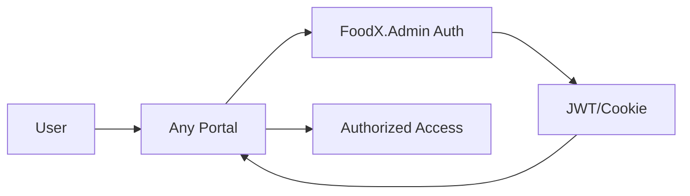

# FDX.Trading Multi-Portal Architecture Guide

## Overview

The FDX.Trading platform uses a **multi-portal architecture** where different user types access dedicated applications, all sharing common business logic and UI components.

## Architecture Components

### 1. Portal Applications (User-Facing)

| Portal | Purpose | Port | User Types | URL |
|--------|---------|------|------------|-----|
| **FoodX.Admin** | Administrative portal | 5193 | SuperAdmin, Admin | http://localhost:5193 |
| **FoodX.Buyer** | Buyer operations | 5000 | Buyers, Procurement Teams | http://localhost:5000 |
| **FoodX.Supplier** | Supplier management | 5001 | Suppliers, Sellers | http://localhost:5001 |
| **FoodX.Marketplace** | Public marketplace | 5002 | Public, All Users | http://localhost:5002 |

### 2. Shared Libraries

| Library | Purpose | Used By |
|---------|---------|---------|
| **FoodX.Core** | Business logic, data access, services | All portals |
| **FoodX.SharedUI** | Reusable Blazor components | All portals |

## Development Setup

### Prerequisites
- .NET 9.0 SDK
- Visual Studio 2022 or VS Code
- SQL Server or Azure SQL Database
- Node.js (for frontend assets)

### Initial Setup

1. **Clone the repository**
   ```bash
   git clone https://github.com/your-org/FDX.trading.git
   cd FDX.trading
   ```

2. **Restore packages**
   ```bash
   dotnet restore FDX.trading.sln
   ```

3. **Configure connection strings**
   Update `appsettings.Development.json` in each portal:
   ```json
   {
     "ConnectionStrings": {
       "DefaultConnection": "your-connection-string"
     }
   }
   ```

4. **Run database migrations**
   ```bash
   cd FoodX.Admin
   dotnet ef database update
   ```

### Running the Platform

#### Option 1: Visual Studio
1. Open `FDX.trading.sln`
2. Right-click solution → Properties
3. Select "Multiple startup projects"
4. Set all portals to "Start"
5. Press F5

#### Option 2: Command Line (Parallel)
```bash
# Terminal 1
cd FoodX.Admin && dotnet run

# Terminal 2  
cd FoodX.Buyer && dotnet run

# Terminal 3
cd FoodX.Supplier && dotnet run

# Terminal 4
cd FoodX.Marketplace && dotnet run
```

#### Option 3: PowerShell Script
```powershell
# Save as run-all.ps1
Start-Process dotnet -ArgumentList "run --project FoodX.Admin"
Start-Process dotnet -ArgumentList "run --project FoodX.Buyer"
Start-Process dotnet -ArgumentList "run --project FoodX.Supplier"
Start-Process dotnet -ArgumentList "run --project FoodX.Marketplace"
```

## Architecture Patterns

### 1. Shared Business Logic
All business logic resides in `FoodX.Core`:
- Models
- Services
- Repositories
- Data Access

**Example**: Adding a new service
```csharp
// In FoodX.Core/Services/IOrderService.cs
public interface IOrderService
{
    Task<Order> CreateOrderAsync(CreateOrderDto dto);
}

// In FoodX.Core/Services/OrderService.cs
public class OrderService : IOrderService
{
    // Implementation
}

// Register in each portal's Program.cs
builder.Services.AddScoped<IOrderService, OrderService>();
```

### 2. Shared UI Components
Reusable components in `FoodX.SharedUI`:

```razor
@* In FoodX.SharedUI/Components/ProductCard.razor *@
<MudCard>
    <MudCardContent>
        <MudText>@Product.Name</MudText>
        <MudText>@Product.Price</MudText>
    </MudCardContent>
</MudCard>

@* Use in any portal *@
<ProductCard Product="@myProduct" />
```

### 3. Authentication Flow


### 4. Data Access Pattern
```csharp
// All data access through FoodX.Core
public class BuyerPortalService
{
    private readonly IUnitOfWork _unitOfWork;
    
    public async Task<List<Product>> GetProductsForBuyerAsync(int buyerId)
    {
        // Business logic in Core
        return await _unitOfWork.Products
            .GetForBuyerAsync(buyerId);
    }
}
```

## Development Guidelines

### 1. Where to Add Code

| Type | Location | Example |
|------|----------|---------|
| Business Logic | FoodX.Core/Services | OrderService.cs |
| Data Models | FoodX.Core/Models | Product.cs |
| Shared Components | FoodX.SharedUI | DataTable.razor |
| Portal-Specific UI | [Portal]/Components/Pages | BuyerDashboard.razor |
| API Controllers | [Portal]/Controllers | OrderController.cs |

### 2. Dependency Management
- Core packages → FoodX.Core
- UI packages → FoodX.SharedUI or specific portal
- Avoid duplicate packages across projects

### 3. Configuration Management
```csharp
// In FoodX.Core/Configuration/AppSettings.cs
public class AppSettings
{
    public string ConnectionString { get; set; }
    public EmailSettings Email { get; set; }
    public AzureSettings Azure { get; set; }
}

// In each portal's Program.cs
builder.Services.Configure<AppSettings>(
    builder.Configuration.GetSection("AppSettings"));
```

### 4. Cross-Portal Communication
Use HTTP clients for portal-to-portal communication:
```csharp
// In FoodX.Buyer calling Admin API
public class AdminApiClient
{
    private readonly HttpClient _httpClient;
    
    public async Task<User> GetUserAsync(int userId)
    {
        return await _httpClient.GetFromJsonAsync<User>(
            $"https://admin.fdx.trading/api/users/{userId}");
    }
}
```

## Testing Strategy

### 1. Unit Tests
```
FoodX.Core.Tests/
├── Services/
├── Repositories/
└── Models/
```

### 2. Integration Tests
```
FoodX.Admin.Tests/
├── Controllers/
├── Pages/
└── Auth/
```

### 3. E2E Tests
```
FoodX.E2E.Tests/
├── Workflows/
│   ├── OrderWorkflow.cs
│   └── RegistrationWorkflow.cs
└── CrossPortal/
```

## Deployment

### 1. Azure App Service (Recommended)
```yaml
# azure-pipelines.yml
- task: DotNetCoreCLI@2
  inputs:
    command: 'publish'
    projects: |
      FoodX.Admin/FoodX.Admin.csproj
      FoodX.Buyer/FoodX.Buyer.csproj
      FoodX.Supplier/FoodX.Supplier.csproj
    arguments: '--configuration Release'
```

### 2. Docker Containers
```dockerfile
# Dockerfile.Admin
FROM mcr.microsoft.com/dotnet/aspnet:9.0
WORKDIR /app
COPY --from=build /app/FoodX.Admin/out .
ENTRYPOINT ["dotnet", "FoodX.Admin.dll"]
```

### 3. URL Structure in Production
```
https://admin.fdx.trading     → FoodX.Admin
https://buyer.fdx.trading     → FoodX.Buyer
https://supplier.fdx.trading  → FoodX.Supplier
https://fdx.trading           → FoodX.Marketplace
```

## Troubleshooting

### Common Issues

1. **Port Already in Use**
   ```bash
   # Windows
   netstat -ano | findstr :5193
   taskkill /PID <PID> /F
   ```

2. **Database Connection Issues**
   - Check connection string in appsettings.json
   - Verify SQL Server is running
   - Check firewall rules

3. **Missing Dependencies**
   ```bash
   dotnet restore
   dotnet build
   ```

4. **Authentication Not Working Across Portals**
   - Ensure same machine key in all portals
   - Check cookie domain settings
   - Verify CORS configuration

## Performance Optimization

### 1. Caching Strategy
- Memory cache in each portal
- Redis for distributed cache
- Output caching for static content

### 2. Database Optimization
- Use async/await everywhere
- Implement pagination
- Add appropriate indexes
- Use projection for read-only queries

### 3. Frontend Optimization
- Lazy load components
- Use virtualization for large lists
- Minimize JavaScript interop
- Enable response compression

## Security Considerations

### 1. Portal Isolation
- Each portal has specific role checks
- No cross-portal session sharing
- Separate API keys per portal

### 2. Data Access Control
```csharp
// In FoodX.Core/Services/SecureDataService.cs
public async Task<Product> GetProductAsync(int id, ClaimsPrincipal user)
{
    if (!await CanAccessProduct(id, user))
        throw new UnauthorizedAccessException();
    
    return await _repository.GetAsync(id);
}
```

### 3. API Security
- JWT tokens with short expiry
- Rate limiting per portal
- API versioning
- Request validation

## Monitoring & Logging

### 1. Application Insights
```csharp
// In Program.cs
builder.Services.AddApplicationInsightsTelemetry();
```

### 2. Structured Logging
```csharp
// Using Serilog
Log.Information("User {UserId} accessed {Portal} at {Time}", 
    userId, portalName, DateTime.UtcNow);
```

### 3. Health Checks
```csharp
builder.Services.AddHealthChecks()
    .AddSqlServer(connectionString)
    .AddRedis(redisConnection);
```

## Team Responsibilities

| Team | Owns | Responsibilities |
|------|------|------------------|
| Platform Team | FoodX.Core, SharedUI | Core features, shared components |
| Admin Team | FoodX.Admin | User management, system config |
| Buyer Team | FoodX.Buyer | Procurement features |
| Supplier Team | FoodX.Supplier | Inventory, pricing |
| Marketplace Team | FoodX.Marketplace | Public features, SEO |

## Version Management

### Semantic Versioning
```
FoodX.Core: 2.1.0
FoodX.SharedUI: 1.5.0
FoodX.Admin: 1.0.0
FoodX.Buyer: 1.0.0
FoodX.Supplier: 1.0.0
```

### Breaking Changes Protocol
1. Announce in team channel
2. Update Core with backward compatibility
3. Update portals one by one
4. Remove deprecated code after all updates

## Resources

- [Architecture Decision Records](./ADR/)
- [API Documentation](./API/)
- [Component Library](./Components/)
- [Database Schema](./Database/)
- [Deployment Guide](./Deployment/)

## Contact

- Platform Team: platform@fdx.trading
- DevOps: devops@fdx.trading
- Architecture: architecture@fdx.trading